# UAV-MCP 无人机路径规划与智能重规划系统 - 完整流程图

## 系统架构总览

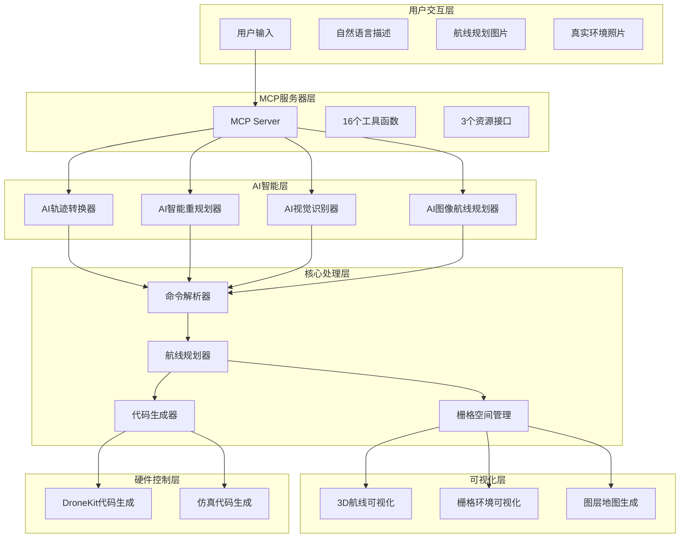

## 完整工作流程图

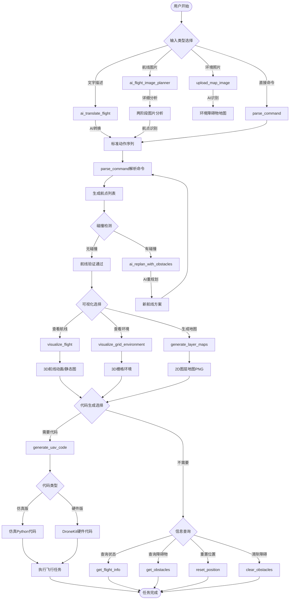

## 核心模块交互流程

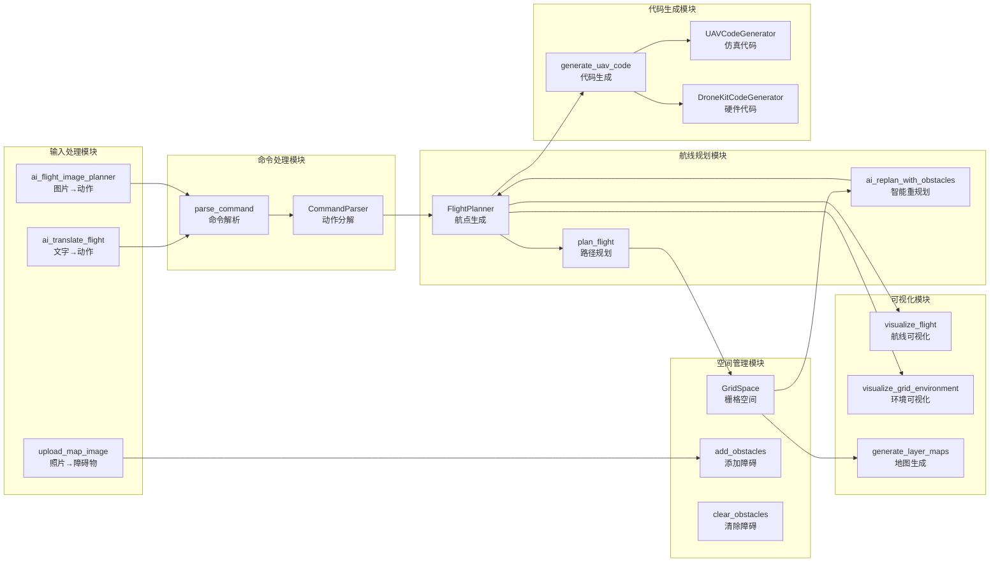

## AI图像航线规划详细流程

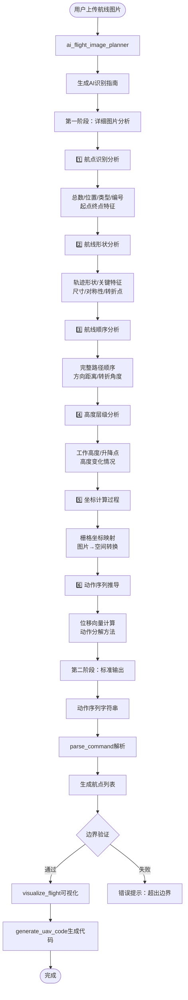

## AI智能重规划流程

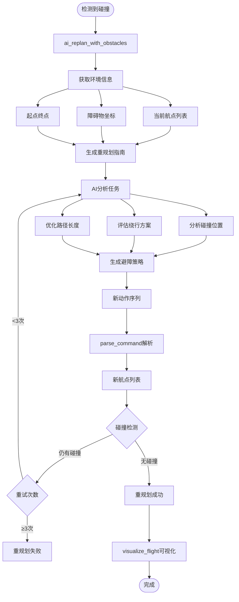

## 环境感知与建模流程

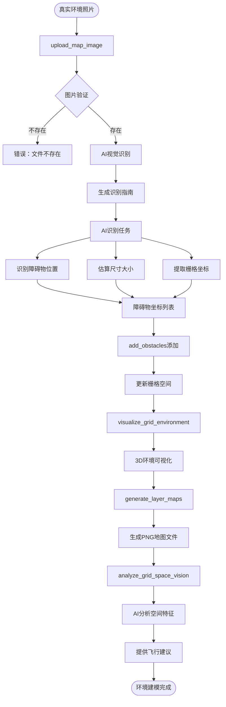

## 可视化与代码生成流程

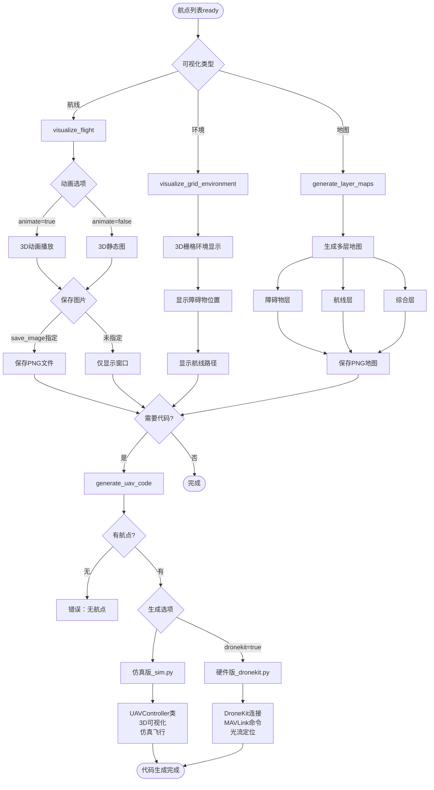

## 完整数据流图

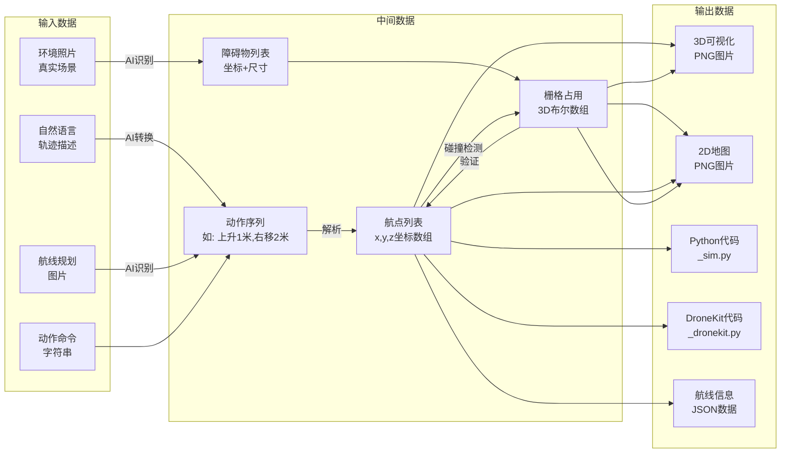

## 16个工具函数关系图

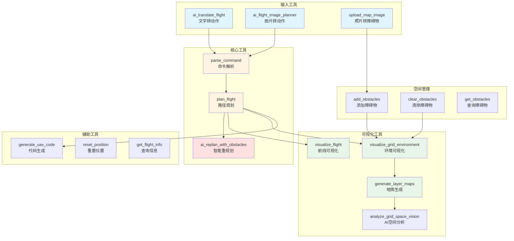

## 核心类关系图

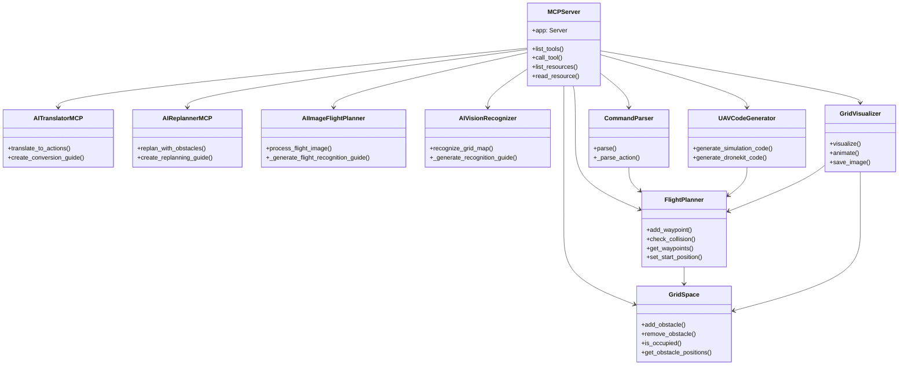

## 完整使用场景流程

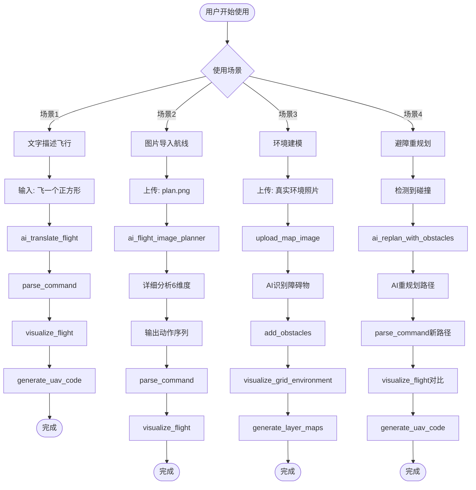

---

## 流程图说明

### 系统特点
1. **模块化设计**: 16个工具函数各司其职，相互协作
2. **AI驱动**: 4个AI模块提供智能转换、识别、重规划能力
3. **两阶段分析**: 图像航线规划采用详细分析+标准输出模式
4. **完整闭环**: 从输入到可视化到代码生成，形成完整工作流
5. **安全保障**: 碰撞检测、边界验证、智能重规划确保安全

### 核心流程
1. **输入阶段**: 支持文字、图片、照片三种输入方式
2. **处理阶段**: AI转换→命令解析→航点生成→碰撞检测
3. **优化阶段**: 智能重规划→路径优化→安全验证
4. **输出阶段**: 3D可视化→地图生成→代码生成→硬件执行

### 数据流向
输入数据 → AI处理 → 中间数据 → 核心处理 → 输出数据 → 硬件执行
